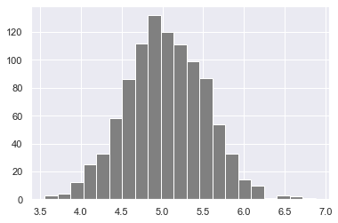

<div align="center">
  <h1> 30 Days Of Python: Day 24 - Statistics</h1>
  <a class="header-badge" target="_blank" href="https://www.linkedin.com/in/asabeneh/">
  
  </a>
  <a class="header-badge" target="_blank" href="https://twitter.com/Asabeneh">
  
  </a>

<sub>Author:
<a href="https://www.linkedin.com/in/asabeneh/" target="_blank">Asabeneh Yetayeh</a><br>
<small>Second Edition: July, 2021</small>
</sub>
</div>

[<<第二十三天](../23_Day_Virtual_environment/23_virtual_environment.md) | [第二十五天 >>](../25_Day_Pandas/25_pandas.md)


- [📘 Day 24](#-day-24)
  - [Python for Statistical Analysis](#python-for-statistical-analysis)
  - [Statistics](#statistics)
  - [Data](#data)
  - [Statistics Module](#statistics-module)
- [NumPy](#numpy)

# 📘 第24天

## Python用于统计分析

## 统计数据

统计学是研究数据的收集、组织、显示、分析、解释和呈现的学科。
统计学是数学的一个分支，被推荐为数据科学和机器学习的先决条件。统计是一个非常广泛的领域，但我们将在本节中只关注最相关的部分。
完成这个挑战后，你可以走上网络开发、数据分析、机器学习和数据科学的道路。无论你走哪条路，在你职业生涯的某个阶段，你都会得到你可以研究的数据。_data告诉，拥有一些统计知识将帮助你根据数据做出决策。

## 数据

什么是数据？数据是出于某种目的（通常是分析）而收集和翻译的任何一组字符。它可以是任何字符，包括文本和数字、图片、声音或视频。如果数据没有放在上下文中，那么对人类或计算机来说就没有任何意义。为了从数据中理解，我们需要使用不同的工具来处理数据。

数据分析、数据科学或机器学习的工作流程都是从数据开始的。数据可以从某些数据源提供，也可以创建。有结构化和非结构化数据。

数据可以以小格式或大格式找到。我们将得到的大多数数据类型都在文件处理部分中介绍过。

## 统计模块

Python _statistics_模块提供用于计算数值数据的数理统计的函数。该模块并非旨在与NumPy、SciPy等第三方库或针对Minitab、SAS和Matlab等专业统计人员的专有全功能统计软件包竞争。它针对的是绘图和科学计算器的水平。

# NumPy

在第一节中，我们将Python定义为一种伟大的通用编程语言，但在其他流行库（numpy、scipy、matplotlib、pandas等）的帮助下，它成为科学计算的强大环境。

NumPy是Python中科学计算的核心库。它提供了一个高性能的多维数组对象，以及处理数组的工具。

到目前为止，我们一直在使用vscode，但从现在开始，我建议使用Jupyter Notebook。要访问jupyter笔记本，让我们安装[anaconda](https://www.anaconda.com/). 如果您使用的是anaconda，则包含大多数常见软件包，如果您安装了anaconda则没有安装软件包。

```sh
asabeneh@Asabeneh:~/Desktop/30DaysOfPython$ pip install numpy
```

## 导入NumPy

如果您支持[Jupyter notebook]，则可以使用Jupyter notebook(https://github.com/Asabeneh/data-science-for-everyone/blob/master/numpy/numpy.ipynb)

```py
    # How to import numpy
    import numpy as np
    # How to check the version of the numpy package
    print('numpy:', np.__version__)
    # Checking the available methods
    print(dir(np))
```

## 使用创建numpy数组

### 创建int numpy数组

```py
    # Creating python List
    python_list = [1,2,3,4,5]

    # Checking data types
    print('Type:', type (python_list)) # <class 'list'>
    #
    print(python_list) # [1, 2, 3, 4, 5]

    two_dimensional_list = [[0,1,2], [3,4,5], [6,7,8]]

    print(two_dimensional_list)  # [[0, 1, 2], [3, 4, 5], [6, 7, 8]]

    # Creating Numpy(Numerical Python) array from python list

    numpy_array_from_list = np.array(python_list)
    print(type (numpy_array_from_list))   # <class 'numpy.ndarray'>
    print(numpy_array_from_list) # array([1, 2, 3, 4, 5])
```

### 创建浮点numpy数组

Creating a float numpy array from list with a float data type parameter

```py
    # Python list
    python_list = [1,2,3,4,5]

    numy_array_from_list2 = np.array(python_list, dtype=float)
    print(numy_array_from_list2) # array([1., 2., 3., 4., 5.])
```

### 创建布尔numpy数组

从列表创建一个布尔值numpy数组

```py
    numpy_bool_array = np.array([0, 1, -1, 0, 0], dtype=bool)
    print(numpy_bool_array) # array([False,  True,  True, False, False])
```

### 使用numpy创建多维数组

numpy数组可以有一个或多个行和列

```py
    two_dimensional_list = [[0,1,2], [3,4,5], [6,7,8]]
    numpy_two_dimensional_list = np.array(two_dimensional_list)
    print(type (numpy_two_dimensional_list))
    print(numpy_two_dimensional_list)
```

```sh
    <class 'numpy.ndarray'>
    [[0 1 2]
     [3 4 5]
     [6 7 8]]
```

### 将numpy数组转换为列表

```python
# We can always convert an array back to a python list using tolist().
np_to_list = numpy_array_from_list.tolist()
print(type (np_to_list))
print('one dimensional array:', np_to_list)
print('two dimensional array: ', numpy_two_dimensional_list.tolist())
```

```sh
    <class 'list'>
    one dimensional array: [1, 2, 3, 4, 5]
    two dimensional array:  [[0, 1, 2], [3, 4, 5], [6, 7, 8]]
```

### 从元组创建numpy数组

```py
# Numpy array from tuple
# Creating tuple in Python
python_tuple = (1,2,3,4,5)
print(type (python_tuple)) # <class 'tuple'>
print('python_tuple: ', python_tuple) # python_tuple:  (1, 2, 3, 4, 5)

numpy_array_from_tuple = np.array(python_tuple)
print(type (numpy_array_from_tuple)) # <class 'numpy.ndarray'>
print('numpy_array_from_tuple: ', numpy_array_from_tuple) # numpy_array_from_tuple:  [1 2 3 4 5]
```

### numpy数组的形状

shape方法将数组的形状提供为元组。第一个是行，第二个是列。如果数组只有一维，则返回数组的大小。

```py
    nums = np.array([1, 2, 3, 4, 5])
    print(nums)
    print('shape of nums: ', nums.shape)
    print(numpy_two_dimensional_list)
    print('shape of numpy_two_dimensional_list: ', numpy_two_dimensional_list.shape)
    three_by_four_array = np.array([[0, 1, 2, 3],
        [4,5,6,7],
        [8,9,10, 11]])
    print(three_by_four_array.shape)
```

```sh
    [1 2 3 4 5]
    shape of nums:  (5,)
    [[0 1 2]
     [3 4 5]
     [6 7 8]]
    shape of numpy_two_dimensional_list:  (3, 3)
    (3, 4)
```

### numpy数组的数据类型

数据类型类型：str、int、float、complex、bool、list、None

```py
int_lists = [-3, -2, -1, 0, 1, 2,3]
int_array = np.array(int_lists)
float_array = np.array(int_lists, dtype=float)

print(int_array)
print(int_array.dtype)
print(float_array)
print(float_array.dtype)
```

```sh
    [-3 -2 -1  0  1  2  3]
    int64
    [-3. -2. -1.  0.  1.  2.  3.]
    float64
```

### numpy数组的大小

在numpy中，为了知道numpy数组列表中的项目数量，我们使用size

```py
numpy_array_from_list = np.array([1, 2, 3, 4, 5])
two_dimensional_list = np.array([[0, 1, 2],
                              [3, 4, 5],
                              [6, 7, 8]])

print('The size:', numpy_array_from_list.size) # 5
print('The size:', two_dimensional_list.size)  # 3

```

```sh
    The size: 5
    The size: 9
```

## 使用numpy的数学运算

NumPy数组与python列表并不完全相同。要在Python列表中进行数学运算，我们必须循环遍历项目，但numpy可以允许在不循环的情况下进行任何数学运算。
数学运算：

- Addition (+)
- Subtraction (-)
- Multiplication (\*)
- Division (/)
- Modules (%)
- Floor Division(//)
- Exponential(\*\*)

### 补充

```py
# Mathematical Operation
# Addition
numpy_array_from_list = np.array([1, 2, 3, 4, 5])
print('original array: ', numpy_array_from_list)
ten_plus_original = numpy_array_from_list  + 10
print(ten_plus_original)

```

```sh
    original array:  [1 2 3 4 5]
    [11 12 13 14 15]
```

### 减法

```python
# Subtraction
numpy_array_from_list = np.array([1, 2, 3, 4, 5])
print('original array: ', numpy_array_from_list)
ten_minus_original = numpy_array_from_list  - 10
print(ten_minus_original)
```

```sh
    original array:  [1 2 3 4 5]
    [-9 -8 -7 -6 -5]
```

### 乘法

```python
# Multiplication
numpy_array_from_list = np.array([1, 2, 3, 4, 5])
print('original array: ', numpy_array_from_list)
ten_times_original = numpy_array_from_list * 10
print(ten_times_original)
```

```sh
    original array:  [1 2 3 4 5]
    [10 20 30 40 50]
```

### 除法

```python
# Division
numpy_array_from_list = np.array([1, 2, 3, 4, 5])
print('original array: ', numpy_array_from_list)
ten_times_original = numpy_array_from_list / 10
print(ten_times_original)
```

```sh
    original array:  [1 2 3 4 5]
    [0.1 0.2 0.3 0.4 0.5]
```

### 余数

```python
# Modulus; Finding the remainder
numpy_array_from_list = np.array([1, 2, 3, 4, 5])
print('original array: ', numpy_array_from_list)
ten_times_original = numpy_array_from_list % 3
print(ten_times_original)
```

```sh
    original array:  [1 2 3 4 5]
    [1 2 0 1 2]
```

### 向下取整

```py
# Floor division: the division result without the remainder
numpy_array_from_list = np.array([1, 2, 3, 4, 5])
print('original array: ', numpy_array_from_list)
ten_times_original = numpy_array_from_list // 10
print(ten_times_original)
```

### 指数

```py
# Exponential is finding some number the power of another:
numpy_array_from_list = np.array([1, 2, 3, 4, 5])
print('original array: ', numpy_array_from_list)
ten_times_original = numpy_array_from_list  ** 2
print(ten_times_original)
```

```sh
    original array:  [1 2 3 4 5]
    [ 1  4  9 16 25]
```

## 检查数据类型

```py
#Int,  Float numbers
numpy_int_arr = np.array([1,2,3,4])
numpy_float_arr = np.array([1.1, 2.0,3.2])
numpy_bool_arr = np.array([-3, -2, 0, 1,2,3], dtype='bool')

print(numpy_int_arr.dtype)
print(numpy_float_arr.dtype)
print(numpy_bool_arr.dtype)
```

```sh
    int64
    float64
    bool
```

### 转换类型

我们可以转换numpy数组的数据类型

1.从Int到Float

```py
numpy_int_arr = np.array([1,2,3,4], dtype = 'float')
numpy_int_arr
```

    array([1., 2., 3., 4.])

2. 浮点到整数

```py
numpy_int_arr = np.array([1., 2., 3., 4.], dtype = 'int')
numpy_int_arr
```

```sh
    array([1, 2, 3, 4])
```

3. 整数或布尔值

```py
np.array([-3, -2, 0, 1,2,3], dtype='bool')

```

```sh
    array([ True,  True, False,  True,  True,  True])
```

4. Int到str

```py
numpy_float_list.astype('int').astype('str')
```

```sh
    array(['1', '2', '3'], dtype='<U21')
```

## 多维数组

```py
# 2 Dimension Array
two_dimension_array = np.array([(1,2,3),(4,5,6), (7,8,9)])
print(type (two_dimension_array))
print(two_dimension_array)
print('Shape: ', two_dimension_array.shape)
print('Size:', two_dimension_array.size)
print('Data type:', two_dimension_array.dtype)
```

```sh
    <class 'numpy.ndarray'>
    [[1 2 3]
     [4 5 6]
     [7 8 9]]
    Shape:  (3, 3)
    Size: 9
    Data type: int64
```

### 从numpy数组中获取项目

```py
# 2 Dimension Array
two_dimension_array = np.array([[1,2,3],[4,5,6], [7,8,9]])
first_row = two_dimension_array[0]
second_row = two_dimension_array[1]
third_row = two_dimension_array[2]
print('First row:', first_row)
print('Second row:', second_row)
print('Third row: ', third_row)
```

```sh
    First row: [1 2 3]
    Second row: [4 5 6]
    Third row:  [7 8 9]
```

```py
first_column= two_dimension_array[:,0]
second_column = two_dimension_array[:,1]
third_column = two_dimension_array[:,2]
print('First column:', first_column)
print('Second column:', second_column)
print('Third column: ', third_column)
print(two_dimension_array)

```

```sh
    First column: [1 4 7]
    Second column: [2 5 8]
    Third column:  [3 6 9]
    [[1 2 3]
     [4 5 6]
     [7 8 9]]
```

## 切片Numpy数组

numpy中的切片类似于python列表中的切片

```py
two_dimension_array = np.array([[1,2,3],[4,5,6], [7,8,9]])
first_two_rows_and_columns = two_dimension_array[0:2, 0:2]
print(first_two_rows_and_columns)
```

```sh
    [[1 2]
     [4 5]]
```

### 如何反转行和整个数组？

```py
two_dimension_array[::]
```

```sh
    array([[1, 2, 3],
           [4, 5, 6],
           [7, 8, 9]])
```

### 颠倒行和列的位置

```py
    two_dimension_array = np.array([[1,2,3],[4,5,6], [7,8,9]])
    two_dimension_array[::-1,::-1]
```

```sh
    array([[9, 8, 7],
           [6, 5, 4],
           [3, 2, 1]])
```

## 如何表示缺失的值？

```python
    print(two_dimension_array)
    two_dimension_array[1,1] = 55
    two_dimension_array[1,2] =44
    print(two_dimension_array)
```

```sh
    [[1 2 3]
     [4 5 6]
     [7 8 9]]
    [[ 1  2  3]
     [ 4 55 44]
     [ 7  8  9]]
```

```py
    # Numpy Zeroes
    # numpy.zeros(shape, dtype=float, order='C')
    numpy_zeroes = np.zeros((3,3),dtype=int,order='C')
    numpy_zeroes
```

```sh
    array([[0, 0, 0],
           [0, 0, 0],
           [0, 0, 0]])
```

```py
# Numpy Zeroes
numpy_ones = np.ones((3,3),dtype=int,order='C')
print(numpy_ones)
```

```sh
    [[1 1 1]
     [1 1 1]
     [1 1 1]]
```

```py
twoes = numpy_ones * 2
```

```py
# Reshape
# numpy.reshape(), numpy.flatten()
first_shape  = np.array([(1,2,3), (4,5,6)])
print(first_shape)
reshaped = first_shape.reshape(3,2)
print(reshaped)

```

```sh
    [[1 2 3]
     [4 5 6]]
    [[1 2]
     [3 4]
     [5 6]]
```

```py
flattened = reshaped.flatten()
flattened
```

```sh
    array([1, 2, 3, 4, 5, 6])
```

```py
    ## Horitzontal Stack
    np_list_one = np.array([1,2,3])
    np_list_two = np.array([4,5,6])

    print(np_list_one + np_list_two)

    print('Horizontal Append:', np.hstack((np_list_one, np_list_two)))
```

```sh
    [5 7 9]
    Horizontal Append: [1 2 3 4 5 6]
```

```py
    ## Vertical Stack
    print('Vertical Append:', np.vstack((np_list_one, np_list_two)))
```

```sh
    Vertical Append: [[1 2 3]
     [4 5 6]]
```

#### 生成随机数

```py
    # Generate a random float  number
    random_float = np.random.random()
    random_float
```

```sh
    0.018929887384753874
```

```py
    # Generate a random float  number
    random_floats = np.random.random(5)
    random_floats
```

```sh
    array([0.26392192, 0.35842215, 0.87908478, 0.41902195, 0.78926418])
```

```py
    # Generating a random integers between 0 and 10

    random_int = np.random.randint(0, 11)
    random_int
```

```sh
    4
```

```py
    # Generating a random integers between 2 and 11, and creating a one row array
    random_int = np.random.randint(2,10, size=4)
    random_int
```

```sh
    array([8, 8, 8, 2])
```

```py
    # Generating a random integers between 0 and 10
    random_int = np.random.randint(2,10, size=(3,3))
    random_int
```

```sh
    array([[3, 5, 3],
           [7, 3, 6],
           [2, 3, 3]])
```

### 世代随机数

```py
    # np.random.normal(mu, sigma, size)
    normal_array = np.random.normal(79, 15, 80)
    normal_array

```

```sh
    array([ 89.49990595,  82.06056961, 107.21445842,  38.69307086,
            47.85259157,  93.07381061,  76.40724259,  78.55675184,
            72.17358173,  47.9888899 ,  65.10370622,  76.29696568,
            95.58234254,  68.14897213,  38.75862686, 122.5587927 ,
            67.0762565 ,  95.73990864,  81.97454563,  92.54264805,
            59.37035153,  77.76828101,  52.30752166,  64.43109931,
            62.63695351,  90.04616138,  75.70009094,  49.87586877,
            80.22002414,  68.56708848,  76.27791052,  67.24343975,
            81.86363935,  78.22703433, 102.85737041,  65.15700341,
            84.87033426,  76.7569997 ,  64.61321853,  67.37244562,
            74.4068773 ,  58.65119655,  71.66488727,  53.42458179,
            70.26872028,  60.96588544,  83.56129414,  72.14255326,
            81.00787609,  71.81264853,  72.64168853,  86.56608717,
            94.94667321,  82.32676973,  70.5165446 ,  85.43061003,
            72.45526212,  87.34681775,  87.69911217, 103.02831489,
            75.28598596,  67.17806893,  92.41274447, 101.06662611,
            87.70013935,  70.73980645,  46.40368207,  50.17947092,
            61.75618542,  90.26191397,  78.63968639,  70.84550744,
            88.91826581, 103.91474733,  66.3064638 ,  79.49726264,
            70.81087439,  83.90130623,  87.58555972,  59.95462521])
```

## Numpy和统计

```py
import matplotlib.pyplot as plt
import seaborn as sns
sns.set()
plt.hist(normal_array, color="grey", bins=50)
```

```sh
    (array([2., 0., 0., 0., 1., 2., 2., 0., 2., 0., 0., 1., 2., 2., 1., 4., 3.,
            4., 2., 7., 2., 2., 5., 4., 2., 4., 3., 2., 1., 5., 3., 0., 3., 2.,
            1., 0., 0., 1., 3., 0., 1., 0., 0., 0., 0., 0., 0., 0., 0., 1.]),
     array([ 38.69307086,  40.37038529,  42.04769973,  43.72501417,
             45.4023286 ,  47.07964304,  48.75695748,  50.43427191,
             52.11158635,  53.78890079,  55.46621523,  57.14352966,
             58.8208441 ,  60.49815854,  62.17547297,  63.85278741,
             65.53010185,  67.20741628,  68.88473072,  70.56204516,
             72.23935959,  73.91667403,  75.59398847,  77.27130291,
             78.94861734,  80.62593178,  82.30324622,  83.98056065,
             85.65787509,  87.33518953,  89.01250396,  90.6898184 ,
             92.36713284,  94.04444727,  95.72176171,  97.39907615,
             99.07639058, 100.75370502, 102.43101946, 104.1083339 ,
            105.78564833, 107.46296277, 109.14027721, 110.81759164,
            112.49490608, 114.17222052, 115.84953495, 117.52684939,
            119.20416383, 120.88147826, 122.5587927 ]),
     <a list of 50 Patch objects>)
```

### numpy中的矩阵

```py

four_by_four_matrix = np.matrix(np.ones((4,4), dtype=float))
```

```py
four_by_four_matrix
```

```sh
matrix([[1., 1., 1., 1.],
            [1., 1., 1., 1.],
            [1., 1., 1., 1.],
            [1., 1., 1., 1.]])
```

```py
np.asarray(four_by_four_matrix)[2] = 2
four_by_four_matrix
```

```sh

matrix([[1., 1., 1., 1.],
            [1., 1., 1., 1.],
            [2., 2., 2., 2.],
            [1., 1., 1., 1.]])
```

### Numpy Numpy.arange（）

#### 什么是安排？

有时，您希望创建在定义的间隔内均匀间隔的值。例如，您想创建从1到10的值；您可以使用numpy.arange（）函数

```py
# creating list using range(starting, stop, step)
lst = range(0, 11, 2)
lst
```

```python
range(0, 11, 2)
```

```python
for l in lst:
    print(l)
```

```sh 0
    2
    4
    6
    8
    10
```

```py
# Similar to range arange numpy.arange(start, stop, step)
whole_numbers = np.arange(0, 20, 1)
whole_numbers
```

```sh
array([ 0,  1,  2,  3,  4,  5,  6,  7,  8,  9, 10, 11, 12, 13, 14, 15, 16,
           17, 18, 19])
```

```py
natural_numbers = np.arange(1, 20, 1)
natural_numbers
```

```py
odd_numbers = np.arange(1, 20, 2)
odd_numbers
```

```sh
    array([ 1,  3,  5,  7,  9, 11, 13, 15, 17, 19])
```

```py
even_numbers = np.arange(2, 20, 2)
even_numbers
```

```sh
    array([ 2,  4,  6,  8, 10, 12, 14, 16, 18])
```

### 使用linspace创建数字序列

```py
# numpy.linspace()
# numpy.logspace() in Python with Example
# For instance, it can be used to create 10 values from 1 to 5 evenly spaced.
np.linspace(1.0, 5.0, num=10)
```

```sh
    array([1.        , 1.44444444, 1.88888889, 2.33333333, 2.77777778,
           3.22222222, 3.66666667, 4.11111111, 4.55555556, 5.        ])
```

```py
# not to include the last value in the interval
np.linspace(1.0, 5.0, num=5, endpoint=False)
```

```
array([1. , 1.8, 2.6, 3.4, 4.2])
```

```py
# LogSpace
# LogSpace returns even spaced numbers on a log scale. Logspace has the same parameters as np.linspace.

# Syntax:

# numpy.logspace(start, stop, num, endpoint)

np.logspace(2, 4.0, num=4)
```

```sh

array([  100.        ,   464.15888336,  2154.43469003, 10000.        ])
```

```py
# to check the size of an array
x = np.array([1,2,3], dtype=np.complex128)
```

```py
x
```

```sh
    array([1.+0.j, 2.+0.j, 3.+0.j])
```

```py
x.itemsize
```

```sh
16
```

```py
# indexing and Slicing NumPy Arrays in Python
np_list = np.array([(1,2,3), (4,5,6)])
np_list

```

```sh
    array([[1, 2, 3],
           [4, 5, 6]])
```

```py
print('First row: ', np_list[0])
print('Second row: ', np_list[1])

```

```sh

    First row:  [1 2 3]
    Second row:  [4 5 6]
```

```p
print('First column: ', np_list[:,0])
print('Second column: ', np_list[:,1])
print('Third column: ', np_list[:,2])

```

```sh
    First column:  [1 4]
    Second column:  [2 5]
    Third column:  [3 6]
```

### NumPy统计函数示例

NumPy具有非常有用的统计函数，用于从数组中的给定元素中查找最小值、最大值、均值、中值、百分位数、标准差和方差等。
功能解释如下：
统计函数
Numpy配备了如下所列的稳健统计功能

- Numpy Functions
  - Min np.min()
  - Max np.max()
  - Mean np.mean()
  - Median np.median()
  - Varience
  - Percentile
  - Standard deviation np.std()

```python
np_normal_dis = np.random.normal(5, 0.5, 100)
np_normal_dis
## min, max, mean, median, sd
print('min: ', two_dimension_array.min())
print('max: ', two_dimension_array.max())
print('mean: ',two_dimension_array.mean())
# print('median: ', two_dimension_array.median())
print('sd: ', two_dimension_array.std())
```

    min:  1
    max:  55
    mean:  14.777777777777779
    sd:  18.913709183069525

```python
min:  1
max:  55
mean:  14.777777777777779
sd:  18.913709183069525
```

```python
print(two_dimension_array)
print('Column with minimum: ', np.amin(two_dimension_array,axis=0))
print('Column with maximum: ', np.amax(two_dimension_array,axis=0))
print('=== Row ==')
print('Row with minimum: ', np.amin(two_dimension_array,axis=1))
print('Row with maximum: ', np.amax(two_dimension_array,axis=1))
```

    [[ 1  2  3]
     [ 4 55 44]
     [ 7  8  9]]
    Column with minimum:  [1 2 3]
    Column with maximum:  [ 7 55 44]
    === Row ==
    Row with minimum:  [1 4 7]
    Row with maximum:  [ 3 55  9]

### 如何创建重复序列？

```python
a = [1,2,3]

# Repeat whole of 'a' two times
print('Tile:   ', np.tile(a, 2))

# Repeat each element of 'a' two times
print('Repeat: ', np.repeat(a, 2))

```

    Tile:    [1 2 3 1 2 3]
    Repeat:  [1 1 2 2 3 3]

### 如何生成随机数？

```python
# One random number between [0,1)
one_random_num = np.random.random()
one_random_in = np.random
print(one_random_num)
```

    0.6149403282678213

```python
0.4763968133790438
```

    0.4763968133790438

```python
# Random numbers between [0,1) of shape 2,3
r = np.random.random(size=[2,3])
print(r)
```

    [[0.13031737 0.4429537  0.1129527 ]
     [0.76811539 0.88256594 0.6754075 ]]

```python
print(np.random.choice(['a', 'e', 'i', 'o', 'u'], size=10))
```

    ['u' 'o' 'o' 'i' 'e' 'e' 'u' 'o' 'u' 'a']

```python
['i' 'u' 'e' 'o' 'a' 'i' 'e' 'u' 'o' 'i']
```

    ['iueoaieuoi']

```python
## Random numbers between [0, 1] of shape 2, 2
rand = np.random.rand(2,2)
rand
```

    array([[0.97992598, 0.79642484],
           [0.65263629, 0.55763145]])

```python
rand2 = np.random.randn(2,2)
rand2

```

    array([[ 1.65593322, -0.52326621],
           [ 0.39071179, -2.03649407]])

```python
# Random integers between [0, 10) of shape 2,5
rand_int = np.random.randint(0, 10, size=[5,3])
rand_int
```

    array([[0, 7, 5],
           [4, 1, 4],
           [3, 5, 3],
           [4, 3, 8],
           [4, 6, 7]])

```py
from scipy import stats
np_normal_dis = np.random.normal(5, 0.5, 1000) # mean, standard deviation, number of samples
np_normal_dis
## min, max, mean, median, sd
print('min: ', np.min(np_normal_dis))
print('max: ', np.max(np_normal_dis))
print('mean: ', np.mean(np_normal_dis))
print('median: ', np.median(np_normal_dis))
print('mode: ', stats.mode(np_normal_dis))
print('sd: ', np.std(np_normal_dis))
```

```sh

    min:  3.557811005458804
    max:  6.876317743643499
    mean:  5.035832048106663
    median:  5.020161980441937
    mode:  ModeResult(mode=array([3.55781101]), count=array([1]))
    sd:  0.489682424165213

```

```python
plt.hist(np_normal_dis, color="grey", bins=21)
plt.show()
```



```python
# numpy.dot(): Dot Product in Python using Numpy
# Dot Product
# Numpy is powerful library for matrices computation. For instance, you can compute the dot product with np.dot

# Syntax

# numpy.dot(x, y, out=None)
```

### 线性代数

1. Dot Product

```python
## Linear algebra
### Dot product: product of two arrays
f = np.array([1,2,3])
g = np.array([4,5,3])
### 1*4+2*5 + 3*6
np.dot(f, g)  # 23
```

### 使用np.matmul（）进行NumPy矩阵乘法

```python
### Matmul: matruc product of two arrays
h = [[1,2],[3,4]]
i = [[5,6],[7,8]]
### 1*5+2*7 = 19
np.matmul(h, i)
```

```sh
    array([[19, 22],
           [43, 50]])

```

```py
## Determinant 2*2 matrix
### 5*8-7*6np.linalg.det(i)
```

```python
np.linalg.det(i)
```

    -1.999999999999999

```python
Z = np.zeros((8,8))
Z[1::2,::2] = 1
Z[::2,1::2] = 1
```

```python
Z
```

    array([[0., 1., 0., 1., 0., 1., 0., 1.],
           [1., 0., 1., 0., 1., 0., 1., 0.],
           [0., 1., 0., 1., 0., 1., 0., 1.],
           [1., 0., 1., 0., 1., 0., 1., 0.],
           [0., 1., 0., 1., 0., 1., 0., 1.],
           [1., 0., 1., 0., 1., 0., 1., 0.],
           [0., 1., 0., 1., 0., 1., 0., 1.],
           [1., 0., 1., 0., 1., 0., 1., 0.]])

```python
new_list = [ x + 2 for x in range(0, 11)]
```

```python
new_list
```

    [2, 3, 4, 5, 6, 7, 8, 9, 10, 11, 12]

```python
[2, 3, 4, 5, 6, 7, 8, 9, 10, 11, 12]
```

    [2, 3, 4, 5, 6, 7, 8, 9, 10, 11, 12]

```python
np_arr = np.array(range(0, 11))
np_arr + 2
```

array([ 2, 3, 4, 5, 6, 7, 8, 9, 10, 11, 12])

对于具有线性关系的量，我们使用线性方程。让我们看看下面的例子：

```python
temp = np.array([1,2,3,4,5])
pressure = temp * 2 + 5
pressure
```

array([ 7, 9, 11, 13, 15])

```python
plt.plot(temp,pressure)
plt.xlabel('Temperature in oC')
plt.ylabel('Pressure in atm')
plt.title('Temperature vs Pressure')
plt.xticks(np.arange(0, 6, step=0.5))
plt.show()
```


使用numpy绘制高斯正态分布。正如您在下面看到的，numpy可以生成随机数。为了创建随机样本，我们需要平均值（μ）、西格玛（标准差）、数据点数量。

```python
mu = 28
sigma = 15
samples = 100000

x = np.random.normal(mu, sigma, samples)
ax = sns.distplot(x);
ax.set(xlabel="x", ylabel='y')
plt.show()
```


# 总结

总之，与python列表的主要区别是：

1. 数组支持矢量化操作，而列表则不支持。
2. 创建数组后，您无法更改其大小。您必须创建一个新数组或覆盖现有数组。
3. 每个数组只有一个dtype。其中的所有项目都应该是该数据类型。
4. 等效的numpy数组比python列表占用的空间少得多。
numpy数组支持布尔索引。

## 💻 Exercises: Day 24

1. 重复所有示例

🎉 CONGRATULATIONS ! 🎉

[<< Day 23](../23_Day_Virtual_environment/23_virtual_environment.md) | [Day 25 >>](../25_Day_Pandas/25_pandas.md)
